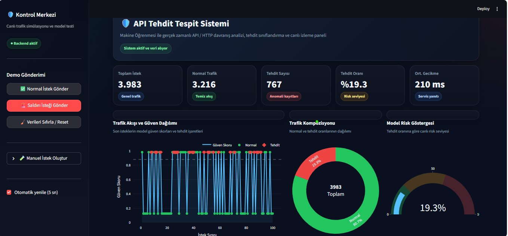
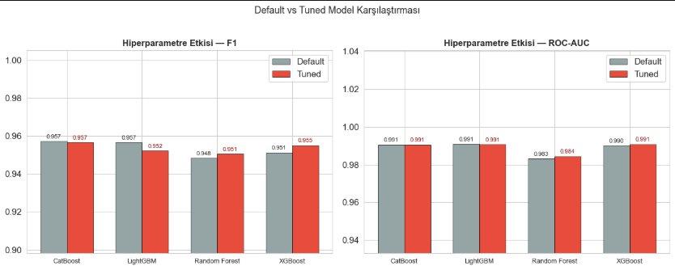
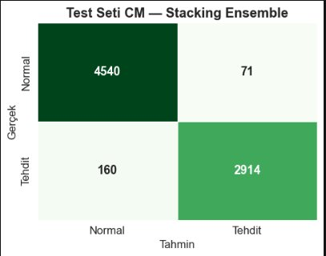
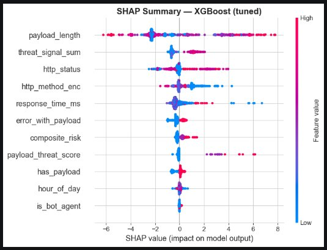

# 🛡️ Makine Öğrenmesi ile API Tehdit Tespit Sistemi

<p align="center">
  
  
  
  
  
  
  
</p>

> API istek loglarından makine öğrenmesi kullanarak tehditleri otomatik tespit eden ikili sınıflandırıcı.  
> **Stacking Ensemble** (XGBoost + LightGBM + CatBoost) + **SHAP** açıklanabilirlik analizi.


---

## 📌 İçindekiler

- [Problem Tanımı](#-problem-tanımı)
- [Canlı Dashboard](#-canlı-dashboard)
- [Veri Seti](#-veri-seti)
- [Özellik Mühendisliği](#-özellik-mühendisliği)
- [Model Pipeline](#-model-pipeline)
- [Model Performansı](#-model-performansı)
- [SHAP Explainability](#-shap-explainability)
- [Kurulum](#-kurulum)
- [Kullanım](#-kullanım)
- [API Referansı](#-api-referansı)
- [Proje Yapısı](#-proje-yapısı)

---

## 🎯 Problem Tanımı

Modern web uygulamalarında API güvenliği kritik bir sorun haline gelmiştir. **Brute Force, SQL Injection (SQLi), DDoS, XSS** gibi saldırılar API'leri hedef almakta ve ciddi güvenlik açıklarına yol açmaktadır.

**Neden Makine Öğrenmesi?**
- Kural tabanlı sistemler yeni saldırı türlerini tespit edemez.
- ML modelleri davranışsal örüntüleri öğrenerek sıfır gün saldırılarını yakalayabilir.
- Büyük hacimli log verilerini gerçek zamanlı analiz edebilir.

- **Hedef Değişken:** `label` → `0 = Normal`, `1 = Tehdit`
- **Problem Tipi:** İkili Sınıflandırma (Binary Classification)

---

## 📸 Canlı Dashboard



Gerçek zamanlı API tehdit izleme paneli. Normal ve saldırı istekleri canlı olarak gönderilip model tarafından sınıflandırılmaktadır.

- **3.983** toplam istek analiz edildi
- **%19.3** tehdit oranı tespit edildi
- **210 ms** ortalama servis yanıt süresi

---

## 📁 Veri Seti

| Özellik | Değer |
|---|---|
| **Dosya** | `api_threat.csv` |
| **Boyut** | 50.000 satır × 11 sütun |
| **Sınıf Dağılımı** | Normal: 30.049 (%60) — Tehdit: 19.951 (%40) |
| **Saldırı Türleri** | 10 farklı saldırı tipi |

### Sütunlar

| Sütun | Açıklama |
|---|---|
| `timestamp` | İstek zamanı |
| `ip_address` | İstemci IP adresi |
| `endpoint` | Hedef API endpoint |
| `http_method` | HTTP metodu (GET, POST, PUT, PATCH, DELETE) |
| `http_status` | HTTP yanıt kodu |
| `user_agent` | Tarayıcı/istemci bilgisi |
| `response_time_ms` | Yanıt süresi (ms) |
| `payload` | İstek gövdesi/parametreler |
| `attack_type` | SQLi / DDoS / XSS / BruteForce / None |
| `composite_risk` | Risk puanı |
| `label` | 0 = Normal, 1 = Tehdit |

---

## ⚙️ Özellik Mühendisliği

Ham veriden şu türetilmiş özellikler oluşturuldu:

| Özellik | Açıklama |
|---|---|
| `http_method_enc` | HTTP metod risk skoru (GET=1 → DELETE=5) |
| `is_bot_agent` | sqlmap, loic, nikto, curl gibi bot user-agent tespiti |
| `has_payload` | Payload varlığı (0/1) |
| `payload_length` | Payload karakter uzunluğu |
| `payload_threat_score` | `OR 1=1`, `DROP TABLE`, `alert(` gibi tehdit anahtar kelime sayısı |
| `threat_signal_sum` | Tüm tehdit sinyallerinin toplamı |
| `error_with_payload` | Hatalı HTTP kodu + payload kombinasyon özelliği |
| `hour_of_day` | İsteğin günün hangi saatinde yapıldığı |
| `endpoint_sensitivity` | Endpoint bazlı tarihsel tehdit oranı |

---

## 🏗️ Model Pipeline

```
API Request Logs
      │
      ▼
Özellik Mühendisliği
      │
      ▼
StandardScaler + SimpleImputer
      │
      ▼
┌──────────────────────────────────────┐
│         Stacking Ensemble            │
│                                      │
│  ┌──────────┐  ┌──────────┐          │
│  │ XGBoost  │  │ LightGBM │          │
│  │ (Optuna) │  │ (Optuna) │          │
│  └────┬─────┘  └────┬─────┘          │
│       │              │               │
│  ┌────┴──────────────┴──┐            │
│  │   CatBoost (Optuna)  │            │
│  │     (Meta-Model)     │            │
│  └──────────────────────┘            │
└──────────────────────────────────────┘
      │
      ▼
SHAP Explainability
      │
      ▼
Threat (1) / Normal (0)
```

**Hiperparametre Optimizasyonu:**

| Model | Yöntem | Detay |
|---|---|---|
| Random Forest | `GridSearchCV` | 5-fold CV |
| XGBoost | `RandomizedSearchCV` | 20 iterasyon |
| CatBoost | `Optuna` | 30 trial, Bayesian |
| LightGBM | `Optuna` | 30 trial, Bayesian |

---

## 🎯 Model Performansı

### Default vs Tuned Karşılaştırması



| Model | F1 (Default) | F1 (Tuned) | ROC-AUC (Default) | ROC-AUC (Tuned) |
|---|---|---|---|---|
| CatBoost | 0.957 | 0.957 | 0.991 | 0.991 |
| LightGBM | 0.957 | 0.952 | 0.991 | 0.991 |
| Random Forest | 0.948 | 0.951 | 0.983 | 0.984 |
| XGBoost | 0.951 | **0.955** | 0.990 | **0.991** |
| **Stacking Ensemble** | — | **En İyi** | — | — |

### Final Test Seti — Stacking Ensemble



| Metrik | Değer |
|---|---|
| **True Positive (Tehdit doğru)** | 2.914 |
| **True Negative (Normal doğru)** | 4.540 |
| **False Positive (Yanlış alarm)** | 71 |
| **False Negative (Kaçırılan tehdit)** | 160 |
| **Precision** | %97.6 |
| **Recall** | %94.8 |
| **F1-Score** | %96.2 |

---

## 🔬 SHAP Explainability



**SHAP (SHapley Additive exPlanations)** analizi ile XGBoost modelindeki her özelliğin tehdit kararına bireysel katkısı görselleştirildi.

**En etkili özellikler (sırasıyla):**
1. `payload_length` — En güçlü tehdit sinyali
2. `threat_signal_sum` — Toplam tehdit skoru
3. `http_status` — HTTP hata kodları
4. `http_method_enc` — Yüksek riskli HTTP metodları
5. `response_time_ms` — Yanıt süresi anomalisi

```python
import shap

xgb_model = trained['XGB_tuned'].named_steps['model']
explainer  = shap.TreeExplainer(xgb_model)
shap_vals  = explainer.shap_values(X_val.sample(500, random_state=42))

shap.summary_plot(shap_vals, X_val.sample(500), feature_names=FEATURE_COLS)
```

---

## 🚀 Kurulum

```bash
# 1. Repoyu klonla
git clone https://github.com/amiri780/api-threat-detection-system.git
cd api-threat-detection-system

# 2. Sanal ortam oluştur
python -m venv venv
source venv/bin/activate      # Linux/Mac
venv\Scripts\activate         # Windows

# 3. Bağımlılıkları yükle
pip install -r requirements.txt
```

---

## 🖥️ Kullanım

### 1. Model Eğitimi

```bash
jupyter notebook Final_Bitirme.ipynb
```

### 2. Modeli Kaydet

```python
import joblib
joblib.dump(trained["Stacking_tuned"], "api_threat_model.joblib")
```

### 3. API Sunucusunu Başlat

```bash
python main.py
# → http://localhost:8000
```

### 4. Dashboard'u Başlat

```bash
python dashboard.py
```

---

## 📡 API Referansı

### `POST /predict`

**Request:**
```json
{
  "ip": "192.168.1.1",
  "method": "POST",
  "endpoint": "/login",
  "payload": "admin' OR '1'='1",
  "response_time_ms": 45,
  "user_agent": "sqlmap/1.0"
}
```

**Response:**
```json
{
  "threat_detected": true,
  "threat_type": "SQLi",
  "confidence": 0.97,
  "shap_explanation": {
    "payload_length": 0.61,
    "threat_signal_sum": 0.22,
    "composite_risk": 0.14
  }
}
```

### `GET /health`
```json
{ "status": "ok" }
```

---

## 📂 Proje Yapısı

```
api-threat-detection-system/
│
├── Final_Bitirme.ipynb     # Model eğitimi, EDA, SHAP analizi
├── main.py                 # FastAPI backend
├── dashboard.py            # Gerçek zamanlı izleme paneli
├── api_threat.csv          # Veri seti (50.000 satır)
├── requirements.txt        # Bağımlılıklar
├── images/
│   ├── dashboard.png       # Canlı dashboard ekranı
│   ├── confusion_matrix.png
│   ├── shap_summary.png
│   └── model_comparison.png
├── LICENSE                 # MIT Lisansı
└── README.md
```

---

## 🔮 Gelecek Çalışmalar

1. **SMOTE** ile sınıf dengesizliğini giderme
2. **Kafka** entegrasyonu ile gerçek zamanlı akış verisi analizi
3. **Docker** ile containerized deployment
4. Daha büyük ve gerçek log veri setleri ile yeniden eğitim

---

## 📄 Lisans

Bu proje MIT Lisansı altında lisanslanmıştır.

---

<p align="center">
  Made with ❤️ by <a href="https://github.com/amiri780">amiri780</a>
</p>
